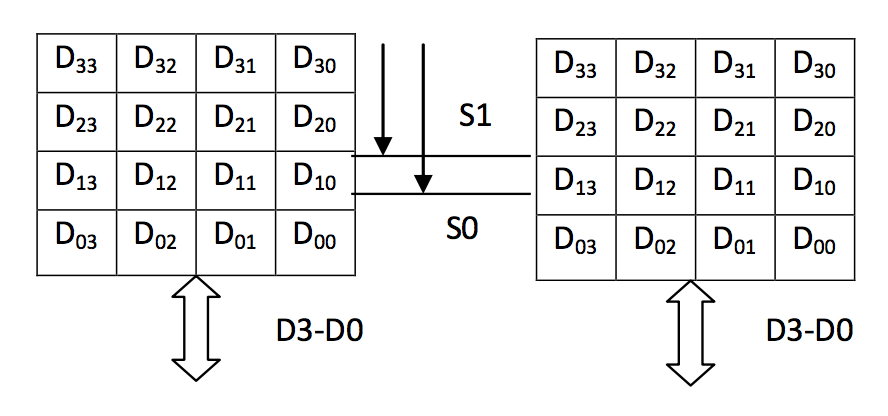
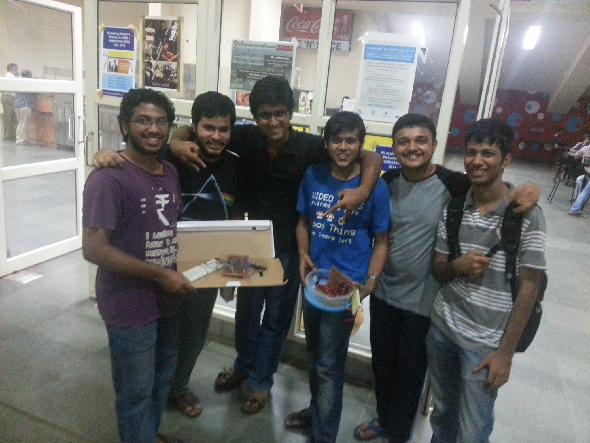

##4x4 RAM Implementation

This project was done as a part of the Digital Design Course.
The objective is to design and implement 2 block 4x4 memory.
The block diagram is shown below. Data should be loaded into 
and read from each of the blocks in a parallel manner. Both 
Blocks are simultaneously accesses but different data can be
written / read from each block.

_memoryblock.v_ is a 8 bit RAM simulation in HDL Verilog.
It contains two testbenches: t_memoryblock1 and t_memoryblock2
Compile the code in ModelSim and Simulate the two testbenches

_t_memoryblock1_ simulates in the following manner:
Writes four values into the memory in first four cycles
Reads the four values from the memory in the next four cycles

_t_memoryblock2_ simulates in the following manner:
Writes one value into the memory in first cycle and reads it in the second
Writes next value into the memory in third cycle and reads it in the fourth
Writes and Reads other values in the remaining cycles

The circuit was physically implemented. Unortunately we don't have 
a video to show. However, here is a picture with the circuit
after successfully implementing it.

