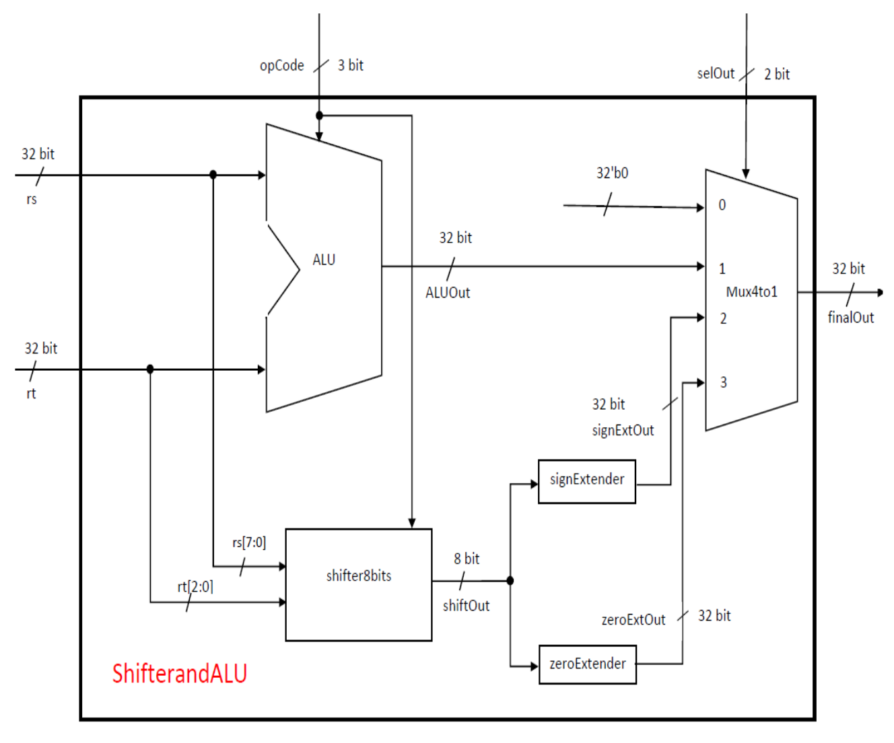
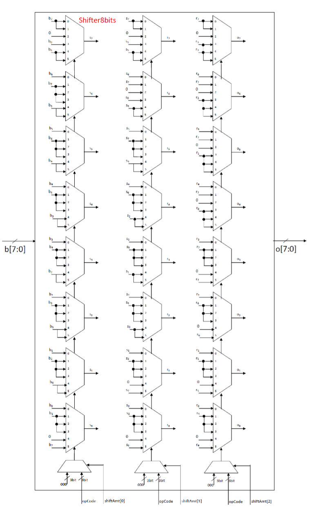
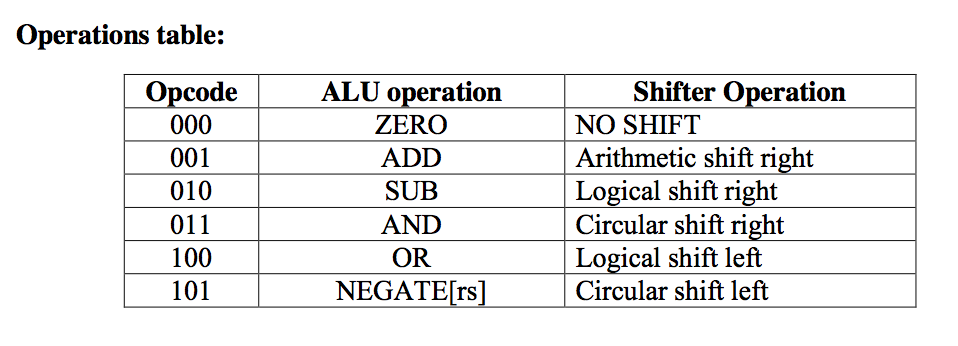
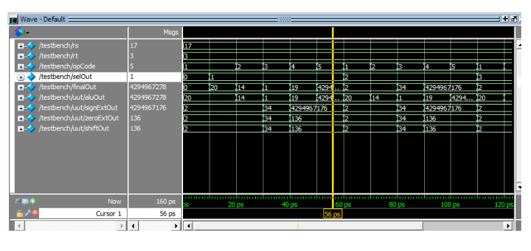

##ALU and Shifter

The objective is to design and implement an ALU and a Shifter. ALU
is responsible for computations add, subtract, and, or, negate. While
a Shifter does the shift operation, i.e. move a bit left/right. The
design of the ALU and Shifter is as follows:

The Shifter design is as follows:

The output obtained by running ALU and Shifter on sample inputs is as follows:

_ALUandShifter.v_ shows its implementation in Verilog HDL