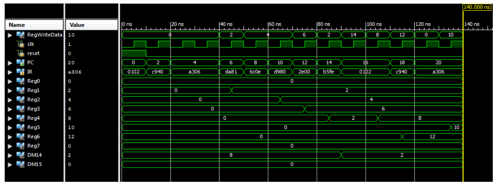

##Hazard Detection

The objective is to design and implement Data Forwarding and Hazard
Detection in a MIPS Pipeline implementation. Running the following
instructions will cause hazard and data forwarding errors:

The simulation results without Data Forwarding and Hazard Detection
would look as follows:

The Pipeline design with Data Forwarding and Hazard Detection is as follows:

The simulation output of _Hazard.v_ (i.e. after implementing Data
Forwarding and Hazard Detection) is as follows:

