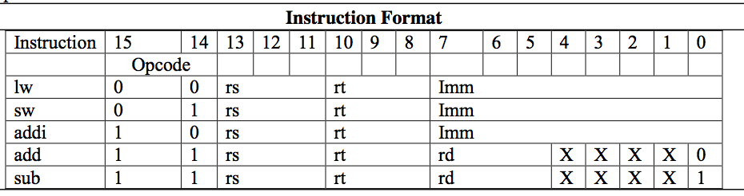
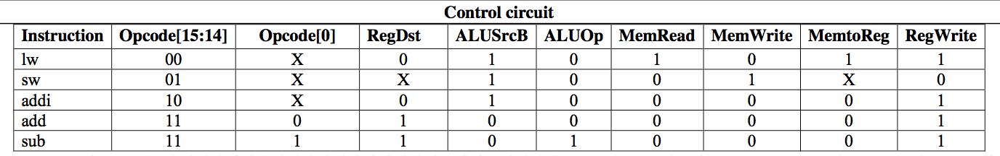
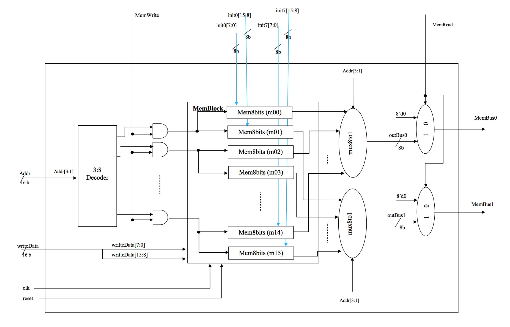
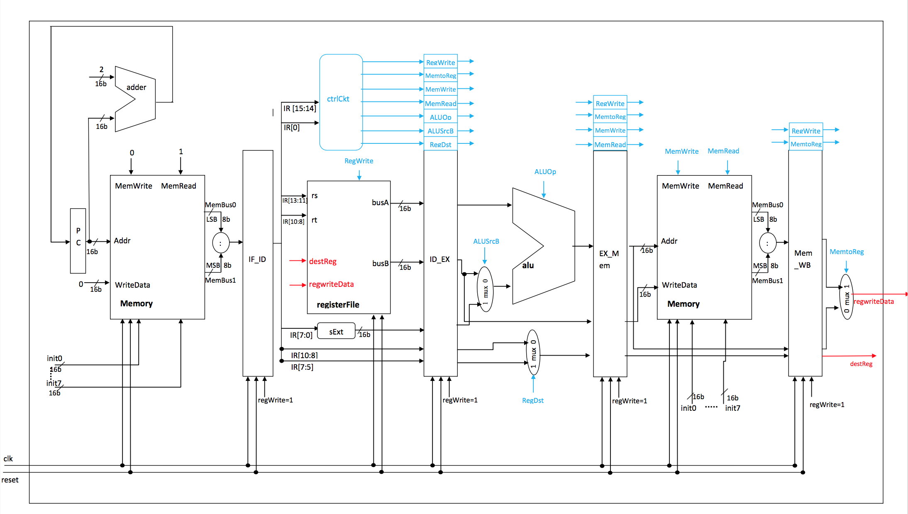
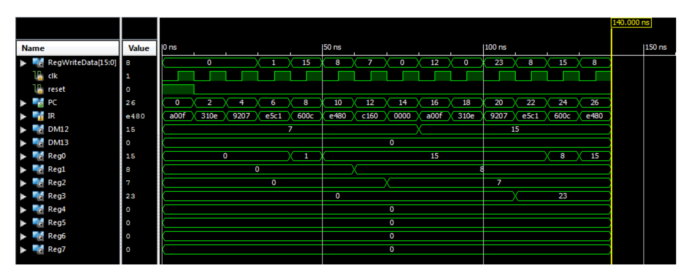

##Pipelining

The objective is to design and implement pipelining in the MIPS
Architecture. The Instruction Format specification is as follows:

The Control Circuit specification is as follows:

MIPS Pipelining Design is as follows:

Results for running the simulation _Pipelining.v_ is as follows:

