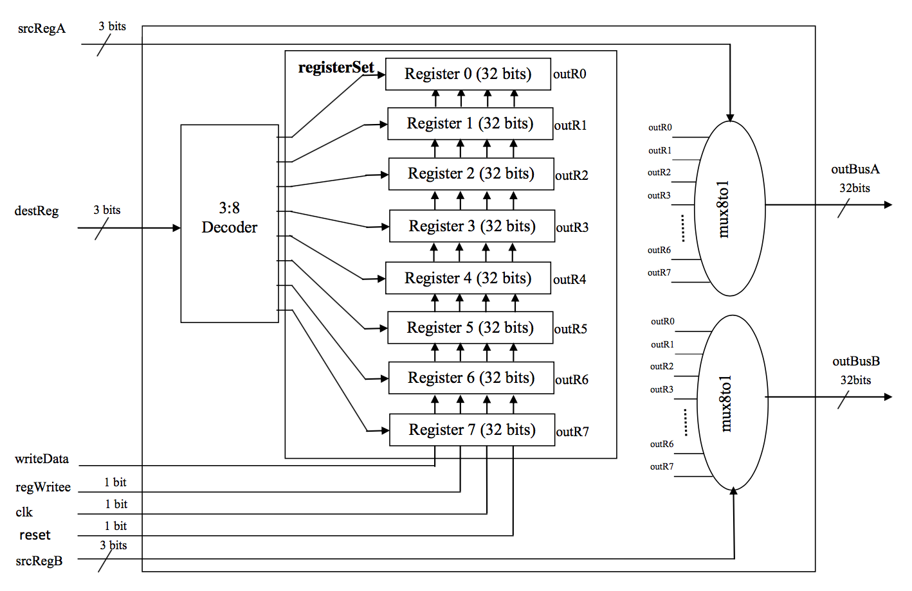

##Register File

The objective is to design and implement a Register File in the MIPS 
Architecture. A Register is a part of the processor that can hold a bit
pattern. And Register file is an aggregation of such individual registers.
The design of the Register File is as follows:

_RegisterFile.v_ shows its implementation in Verilog HDL