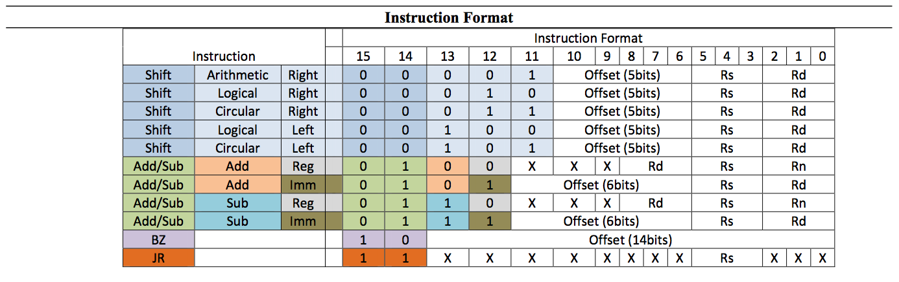
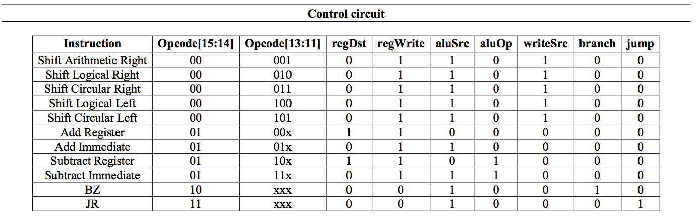
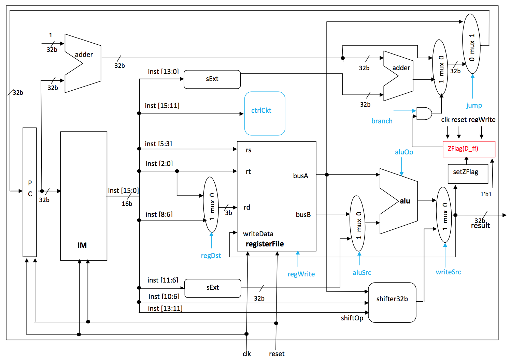
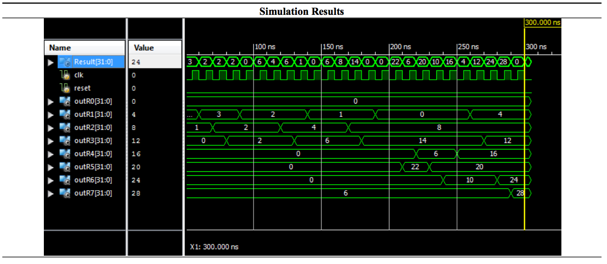

##Single Cycle

The objective is to design and implement a single cycle of 
the MIPS Architecture. The Instruction Format specification is as follows:

The Control Circuit specification is as follows:

The Single Cycle design of a MIPS Architecture is as follows:

Results for running the simulation _SingleCycle.v_ is as follows:

