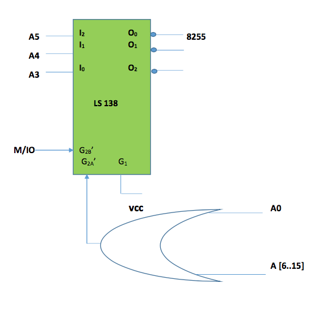

#Smart Lighting System

This project was done as a part of the Microproprocessors and Interfacing
coursework. The objective is to design a Smart Lighting System,
implement it in assembly language for 8086 Microprocessor
and simulate it in the Proteus Simulation Software.

##Problem Description

Design a lighting system for a conference room.
As the seats get filled the light should be turned on.
The rows are filled from row1 onwards. There are 2 lights per row.
As each row begins to get filled the lights get turned on as each
rows empties completely the light gets turned off. You can assume
there are at least 10 rows. Smart Lighting is an automated system 
for lighting conference room designed using 8086 Microprocessor.
 The Problem Scenario is as follows:

####List of Inputs to the system
* 1xPIR Sensor at the entrance
* 10xPIR Sensors for the rows, 1 before each row

####List of Outputs
* 10xRelays connected to 20 Lights

####Assumptions made with respect to the problem
* The conference room has 10 rows.
* Each row can seat a maximum of 10 people
* The room first fills up with people first occupying row 1, then row 2 and so on and then, empties
out with people from the last row leaving first then last but one and finally row 1 is vacated.

####Hardware Used
* 8086 Microprocessor
* Passive Infra Red (PIR) Sensors
* 8255 Programmable Peripheral Interface
* Relays
* 2732 UV Erasable PROM
* LS138 De-multiplexer
* LS245 Bus Transceivers
* LS373 D-type Latch and Edge Triggered Flip-Flop
* 6116 RAM

##Code and Simulation

[_cods.asm_](./code.asm) is the Assembly Language Program file. 
[_smart-lighting.DSN_](./smart-lighting.DSN) is the Proteus Implementation.

##Solution Flowchart

##Hardware Circuit Diagram

####8086 Microprocessor

####Memory Interfacing with 8086 Microprocessor

####I/O Connections for 8255

####Addressing 8255

####Overall Memory Interfacing

RAM – 6116 (2 chips) (RAM (Even) and RAM (Odd)) 
ROM – 2732(2 chips) (ROM (Even) and ROM (Odd)) 
ROM 00000H - 01FFFH 
RAM 02000H – 02FFFH